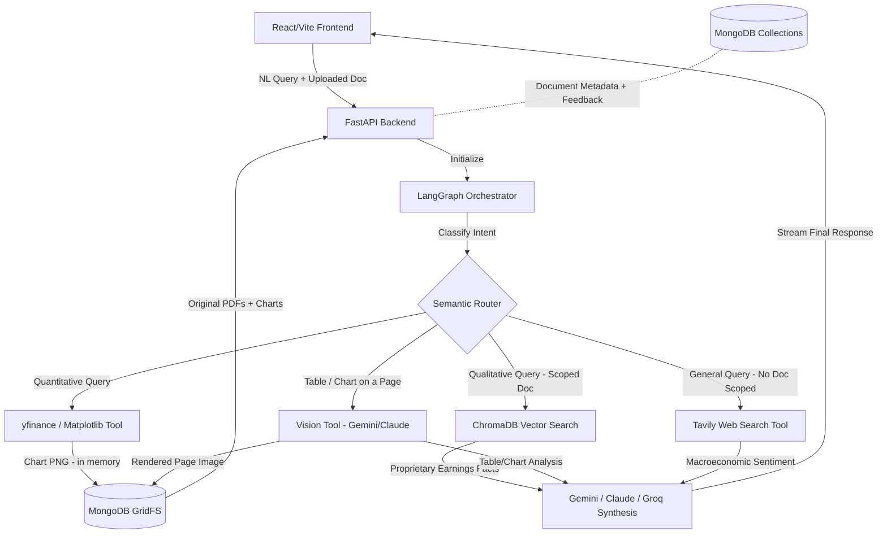

# 📈 Finvisor AI: Agentic Wealth Management Platform


An enterprise-grade, dual-architecture AI system designed to streamline financial analysis and provide context-aware insights via **Retrieval-Augmented Generation (RAG)** and **Autonomous Tool Use**. Finvisor AI intelligently fuses quantitative live-market data pulling with a qualitative LLM brain, allowing investors and analysts to centralize their research workflow into a single, highly aesthetic interface.

The app integrates a fully dynamic **React/Vite** dashboard, a local **ChromaDB Vector Store** for parsing massive earnings reports, a **MongoDB**-backed persistence layer for files and metadata, and a central **LangGraph Orchestrator** that dynamically routes natural language queries between live data generation, semantic text retrieval, and direct visual document inspection.

---

## 🚀 Key Technical Highlights

### 1. The Quantitative Engine (Live Data & Charts)
*   **The Feature:** Autonomously executes Python scripts leveraging `yfinance` to fetch live historical stock data, combined with `matplotlib` for real-time visualization generation.
*   **The Impact:** Bypasses static LLM knowledge cutoffs. When queried about recent performance, the agent fetches true daily closing prices, plots an analytical chart **entirely in memory**, and streams it back into the chat as a base64-encoded image -- no chart file ever touches local disk.
*   **Storage:** Charts are persisted in **MongoDB GridFS** rather than the local filesystem, so they survive a redeploy and don't trigger spurious file-watcher reloads during development.

### 2. The Research Engine (Tavily Live Search)
*   **The Feature:** Integrated with the Tavily Search API, optimized specifically for LLMs and AI agents, to perform live web queries -- including Tavily's own AI-synthesized answer, prioritized over raw scraped snippets, with empty/junk results filtered out before reaching the model.
*   **The Impact:** Gives the agent the ability to look up breaking macroeconomic news, CEO statements, or sector trends that haven't been captured in historical data or the uploaded documents.
*   **Scoped-document safety:** Web search is **never** used as a fallback when a question is scoped to a specific uploaded document -- if the user has selected a PDF to ask about, the agent answers strictly from that document (or honestly says it doesn't know) rather than silently substituting unrelated internet content.

### 3. The Text Brain (Qualitative RAG)
*   **The Feature:** Ingests raw, unstructured financial data (like 10-K Markdown reports and PDF earnings calls), segments them via recursive semantic chunking, and compiles mathematical matrices.
*   **The Impact:** Stores vectorized chunks in a persistent local **ChromaDB** index with a two-stage retriever (semantic search + cross-encoder reranking), allowing the agent to instantly retrieve highly specific, proprietary facts regarding risk analysis, management sentiment, and forward-looking guidance without hallucination.

### 4. The Vision Engine (Multimodal Document Understanding) -- *New*
*   **The Feature:** A dedicated `analyze_document_visually` tool that renders a specific PDF page to an image (via PyMuPDF, no system dependencies) and sends it to a vision-capable model (Gemini or Claude).
*   **The Impact:** Text extraction alone mangles tables and charts embedded in financial PDFs -- a segment-revenue table or a bar chart of quarterly guidance often comes out as scrambled or missing text. This tool lets the agent *look at* the page the way a human analyst would, reading exact figures directly off tables and charts that the text-retrieval pathway can't represent faithfully.

### 5. The Orchestrator (LangGraph Semantic Router)
*   **The Feature:** Acts as the Central Nervous System of the application, now with four pathways instead of three.
*   **The Impact:** It classifies natural language intent and dynamically routes traffic:
    *   *"Plot the 6-month performance of Apple"* -> quantitative `yfinance` tool
    *   *"What were the key risks mentioned in the Q1 report?"* -> RAG vector search
    *   *"What does the table on page 12 show?"* -> vision tool, direct page inspection
    *   *"What's the latest Fed rate decision?"* (no document scoped) -> live web search
*   The orchestrator flawlessly decides *when* and *how* to use each tool, and never confuses a document-scoped question with a general one.

### 6. Multi-Model Task-Based Routing with Automatic Fallback -- *New*
*   **The Feature:** Each task in the pipeline is assigned to a *role* -- `grader` (simple relevance classification, runs on every query), `synthesis` (the actual financial-advisor answer generation), and `vision` (multimodal page analysis) -- and each role has its own ordered provider chain (`GRADER_PROVIDERS`, `SYNTHESIS_PROVIDERS`, `VISION_PROVIDERS`). If a provider errors for any reason (rate limit, quota exhaustion, auth failure, overload), the next provider in that role's chain is tried automatically -- no crash, no hanging through a provider's own retry backoff.
*   **The Impact:** Task-appropriate routing means a cheap, fast model (Groq by default) handles the high-frequency simple classification step, while a stronger model (Gemini, falling back to Claude) is reserved for the task where reasoning quality genuinely matters. Automatic fallback directly addresses a real failure mode this project hit: three vision calls in quick succession exhausted Gemini's free-tier per-minute quota mid-session; with the fallback chain, that third call now goes straight to Claude instead of retrying the same rate-limited provider for the better part of a minute.

### 7. Persistent, Zero-Disk-Dependency Storage (MongoDB) -- *New*
*   **The Feature:** Original uploaded PDFs and generated charts live in **MongoDB GridFS**; document metadata (filename, chunk count, upload time) and user feedback (thumbs up/down + comments) live in dedicated **MongoDB collections** -- one database, one connection, shared across the whole app via a single retry-with-backoff connection module.
*   **The Impact:** Nothing the app needs to function is written to local disk. This means uploads and charts survive a Render redeploy or running more than one backend instance -- problems the original local-filesystem-based version would have hit in any real production deployment.

### 8. Feedback Loop -- *New*
*   **The Feature:** A `POST /feedback` endpoint records a thumbs up/down (plus optional comment) on any answer, tied to the thread and source document.
*   **The Impact:** The first building block for systematically improving retrieval quality over time -- reviewing a stream of (question, answer, rating) rows surfaces which documents or query types consistently get poor ratings, rather than relying on anecdotal impressions.

### 9. Premium "Dark Obsidian" UI/UX
*   **The Feature:** A custom-built React frontend completely discarding generic styling in favor of state-of-the-art web aesthetics.
*   **The Impact:** Implements heavy CSS glassmorphism, dynamic ambient animated backgrounds, physics-based message staggering, and intelligent interactive prompt chips to provide an incredibly premium, wealthy user experience.

### 10. Containerized Deployment -- *New*
*   **The Feature:** `Dockerfile`s for both backend (Python slim image) and frontend (multi-stage Node build served via nginx), wired together with `docker-compose.yml` alongside a local MongoDB container for full dev/prod parity.
*   **The Impact:** `docker compose up --build` brings up the entire stack -- frontend, backend, and database -- with zero manual setup, in addition to the existing Render deployment path.

---

## 📊 System Benchmarks & Performance Metrics

Finvisor AI has been heavily benchmarked and tested for production-grade reliability and latency using an automated evaluation pipeline. *(These specific figures were measured on the original Groq/local-disk architecture; the RAG retrieval quality and accuracy numbers below are architecture-independent since they test the ChromaDB retriever itself, not the LLM provider.)*

### 1. Vector Database Scale
* **Dataset**: 10 comprehensive financial documents (Earnings Reports & 10-K Filings for top tech/finance firms).
* **Chunk Density**: 50 localized semantic chunks.
* **Vector Store**: Local ChromaDB instance with embeddings generated using the `BAAI/bge-small-en-v1.5` model.

### 2. Information Retrieval Accuracy
* **Evaluation Method**: Curated test set of 15 complex question/expected-source-document pairs.
* **Top-1 Accuracy**: **100.0%** (The semantic router and retriever isolated the correct document snippet in the #1 position for all test queries).
* **Top-3 Accuracy**: **100.0%**

### 3. End-to-End Pipeline Latency
The following metrics represent the full round-trip from the moment a user submits a natural language query, through LangGraph routing, tool execution, and LLM text synthesis (measured on the original Groq-based pipeline):
* **RAG (Vector Search) Pathway**: P95 Latency of **16.3s** (Average 6.6s)
* **Market Data (yfinance) Pathway**: P95 Latency of **58.7s** (Due to multi-step quantitative data extraction & plotting)
* **Web Search (Tavily) Pathway**: P95 Latency of **5.4s**

---

## 🛠️ System Architecture



---

## 💻 Tech Stack

### **Backend & AI Engine**
*   **FastAPI**: High-performance asynchronous API server.
*   **LangChain & LangGraph**: Orchestrating autonomous agents, tool execution, and semantic routing.
*   **ChromaDB**: Local vector store for qualitative document context, with two-stage retrieval (semantic search + cross-encoder reranking).
*   **Gemini / Claude / Groq / Ollama**: Swappable primary LLM (`LLM_PROVIDER` env var) -- Gemini Flash by default (free tier), Claude, Groq, and local Ollama as drop-in alternatives.
*   **Gemini / Claude / LLaVA Vision**: Multimodal page-image analysis for tables and charts (`VISION_PROVIDER` env var), fully supporting local LLaVA via Ollama.
*   **MongoDB (GridFS + collections)**: Single persistence layer for original PDF/chart files, document metadata, and user feedback.
*   **Redis**: High-performance caching layer for `yfinance` API calls to prevent rate limiting during heavy quantitative analysis.
*   **yfinance & Matplotlib**: Live market data scraping and thread-safe, in-memory dynamic chart rendering.
*   **Tavily API**: Real-time web search capability for macro and company news, with synthesized-answer prioritization.
*   **pypdf / PyMuPDF**: Text extraction for RAG ingestion (`pypdf`) and high-DPI page-image rendering for the vision tool (`PyMuPDF`).
*   **Docker**: Containerized backend, frontend, MongoDB, and Redis via `docker-compose.yml`.

### **Frontend & UI**
*   **React (Vite)**: Lightning-fast frontend tooling and rendering.
*   **React Markdown**: Parsing and rendering complex LLM responses and tables.
*   **Vanilla CSS**: Custom-built, unopinionated stylesheet featuring advanced glassmorphism and keyframe animations.

---

## 📸 Application Screenshots

<div align="center">
  
  
  
  
  
  
  
</div>

---

## ⚙️ Configuration & Setup

### Prerequisites
*   Node.js (v18+)
*   Python (3.9+)
*   A free API key from **Google AI Studio** ([aistudio.google.com/apikey](https://aistudio.google.com/apikey)) -- no card required
*   A free API key from **Tavily** ([tavily.com](https://tavily.com/))
*   A free **MongoDB Atlas** M0 cluster ([mongodb.com/cloud/atlas/register](https://www.mongodb.com/cloud/atlas/register)) -- or a local MongoDB via Docker (see below)
*   *(Optional)* An **Anthropic** or **Groq** API key, if you want to swap the LLM provider

### **Option A: Local Deployment**
```bash
# 1. Clone & Setup Environment
git clone https://github.com/VedMungra/finvisor-ai.git
cd finvisor-ai

# 2. Backend Setup
cd backend
python -m venv venv
# On Windows:
venv\Scripts\activate
# On macOS/Linux:
# source venv/bin/activate
pip install -r requirements.txt

# 3. Configure environment
cp .env.example .env
# Fill in GOOGLE_API_KEY, TAVILY_API_KEY, MONGODB_URI (see table below)

# 4. Start Backend Server
python -m uvicorn api:app --host 0.0.0.0 --port 8000 --reload

# 5. Frontend Setup
# Open a new terminal
cd frontend
npm install
npm run dev
# -> App running at http://localhost:5173
```

### **Option B: Docker Compose (full stack, incl. local MongoDB)**
```bash
git clone https://github.com/VedMungra/finvisor-ai.git
cd finvisor-ai
cp backend/.env.example backend/.env
# Fill in GOOGLE_API_KEY and TAVILY_API_KEY in backend/.env
docker compose up --build
# -> Backend: http://localhost:8000  |  Frontend: http://localhost:5173
```

---

## 🔑 Environment Variables

Create a `.env` file in the `backend/` directory (or copy `.env.example`) and set:

See `backend/.env.example` for the full annotated list. The essentials:

| Variable | Required | Description |
|---|---|---|
| `GRADER_PROVIDERS` | Optional | Comma-separated provider chain for relevance grading. Default: `openai,groq` |
| `SYNTHESIS_PROVIDERS` | Optional | Comma-separated provider chain for final answer generation. Default: `openai,gemini` |
| `VISION_PROVIDERS` | Optional | Comma-separated provider chain for multimodal page analysis. Default: `openai,gemini` |
| `OPENAI_API_KEY` | Yes, for OpenAI in any chain | From [platform.openai.com/api-keys](https://platform.openai.com/api-keys) |
| `OPENAI_GRADER_MODEL` / `OPENAI_SYNTHESIS_MODEL` / `OPENAI_VISION_MODEL` | Optional | Per-role model ids. Defaults `gpt-4.1-mini` / `gpt-4.1` / `gpt-4.1`. Set `OPENAI_MODEL` alone to use one model everywhere |
| `OPENAI_BASE_URL` | Optional | Azure OpenAI or any OpenAI-compatible gateway |
| `GOOGLE_API_KEY` | Yes, for Gemini in any chain | Free key from [Google AI Studio](https://aistudio.google.com/apikey) |
| `GEMINI_MODEL` / `GEMINI_VISION_MODEL` | Optional | Default: `gemini-flash-latest` (auto-updating alias) |
| `ANTHROPIC_API_KEY` | Yes, for Claude in any chain | From [console.anthropic.com](https://console.anthropic.com) |
| `GROQ_API_KEY` | Yes, for Groq in any chain | From [console.groq.com](https://console.groq.com/) |
| `OLLAMA_BASE_URL` / `OLLAMA_MODEL` / `OLLAMA_VISION_MODEL` | Yes, for Ollama in any chain | Defaults `http://localhost:11434`, `llama3.2`, `llava`. The model must actually be pulled (`ollama list`) — a configured-but-unpulled model is reported by `/health` as unusable |
| `TAVILY_API_KEY` | Yes | Live web search key from [Tavily](https://tavily.com/) |
| `MONGODB_URI` | Yes | `mongodb://localhost:27017` for local dev, or an Atlas `mongodb+srv://...` connection string |
| `MONGODB_DB_NAME` | Optional | Defaults to `finvisor` |
| `REDIS_URL` | Optional | `redis://localhost:6379` for local dev caching |
| `CORS_ORIGINS` | Optional | Comma-separated browser origins allowed to call the API. Default: `http://localhost:5173,http://127.0.0.1:5173`. Set this when deploying, or the browser blocks the deployed frontend |
| `CHROMA_DB_DIR` | Optional | Vector-store location. Defaults to `backend/chroma_db`, resolved relative to the source file rather than the working directory |
| `MAX_UPLOAD_MB` | Optional | Upload size cap. Default `25` |
| `CHAT_TIMEOUT_SECONDS` | Optional | Per-request ceiling on `/chat`. Default `180`; expiry returns 504 |
| `LOG_LEVEL` | Optional | Default `INFO` |

---

## 🩺 Troubleshooting

**Start here: `curl http://localhost:8000/health`.** It reports MongoDB, ChromaDB and — per role — which model provider is active and why any others were skipped, without loading a model or calling a hosted API. Most "it's broken" cases are a provider silently dropping out of a chain rather than a crash.

| Symptom | Cause |
|---|---|
| Every document question answers "I don't know" | The vector store is empty. Check `GET /documents`. Note the store is anchored to `backend/chroma_db` regardless of where you launch `uvicorn` from |
| `ImportError` on startup mentioning a LangChain module | A dependency resolved to an incompatible major version. Install the known-good set: `pip install -r requirements.lock.txt` |
| `npm run dev` fails with "Cannot find native binding" or `Permission denied` | `node_modules` was copied between operating systems. Delete it and run `npm install` on this machine |
| Requests take ~40s and logs show `RESOURCE_EXHAUSTED` / `429` | Free-tier quota exhausted; the chain is falling through to a slower provider. This is working as designed — add another provider or wait for the quota window |
| Answers stop citing sources, or a provider "isn't being used" | Check the `providers` block in `/health` |
| Uploads fail but chat works | MongoDB is unreachable. Ingestion still succeeds (chunks are searchable) but the PDF archive and metadata row are skipped, and the response says so |

---

## 🧠 Architecture Notes: What Changed and Why

This project has evolved from its original single-provider, local-disk design into a more resilient, production-oriented, multi-model architecture. A few notable engineering decisions along the way:

- **Task-based model routing over one-size-fits-all**: the grader (simple binary classification, runs on every query) and the synthesizer (the actual advisory answer, where reasoning quality matters) are routed to independently configurable provider chains, rather than sharing one model and one quota pool.
- **Automatic fallback over manual intervention**: each role's provider chain is tried in order on any error -- rate limit, quota, auth, overload -- so a single provider's quota exhaustion degrades gracefully to the next provider instead of crashing the request or hanging through that provider's own retry backoff.
- **Provider abstraction over hardcoding**: rather than swap Groq for Gemini directly in the agent graph, `llm_config.py` exposes `get_llm_for_role(role)` and `invoke_vision_with_fallback(...)`, so the LangGraph nodes never reference a specific provider's client directly.
- **MongoDB consolidation**: file storage (GridFS) and structured metadata/feedback (collections) were unified onto a single database technology and a single shared connection (`mongo_client.py`), rather than running MongoDB alongside a separate SQL database for metadata.
- **Retry-with-backoff on the database connection**: since MongoDB Atlas is reached over the public internet, a transient DNS or TLS hiccup on a restrictive network could previously crash the entire app at startup. The connection layer now retries a few times with a short delay before giving up.
- **Never substitute web search for a scoped document**: if a user explicitly selects a document to ask about, the agent no longer falls back to a generic web search when the local-relevance grader is uncertain -- it answers from the document's own retrieved content (or honestly says it doesn't know), rather than risking an answer built from unrelated internet articles.
- **Everything chart/PDF-related lives in memory until it's in MongoDB**: no intermediate local file is ever written, which avoids both an ephemeral-filesystem data-loss risk in production and spurious dev-server reloads locally.
- **True Concurrency & Thread Safety**: All API endpoints run on background threadpools to avoid blocking the main event loop during long LangGraph/LLM inferences, and Matplotlib chart generation uses the object-oriented API (`fig, ax = plt.subplots`) to eliminate global state clashing.
- **API Rate Limit Protection**: `yfinance` is aggressively cached via Redis. If multiple users ask for the same stock's fundamentals within a short window, the data is served from Redis in milliseconds, completely bypassing Yahoo Finance's strict request limits.

---

## 🔮 Future Improvements

*   **User Authentication & Profiles:** Support for multi-user login, saving customized investment portfolios, and persisting individual chat histories.
*   **Frontend Feedback UI:** Wire up thumbs up/down buttons in the React frontend to the existing `POST /feedback` endpoint (the backend and schema are ready; the UI isn't yet).
*   **Feedback Analytics Endpoint:** A `GET /feedback/summary` endpoint aggregating ratings by document/ticker to make the feedback loop visible and actionable, not just recorded.
*   **Automated Testing & CI:** `pytest` coverage for the vision tool's rendering logic and the MongoDB CRUD helpers, plus a GitHub Actions workflow running them on every push.
*   **Extended Data Providers:** Add tools for AlphaVantage or Bloomberg APIs to pull even deeper fundamental financial metrics and options chain data.

---

<sub>Note: the screenshots above and the benchmark figures reflect the project's original Groq/local-storage architecture. Functionality shown remains accurate; the underlying LLM provider and storage layer have since been upgraded as described in this README.</sub>
